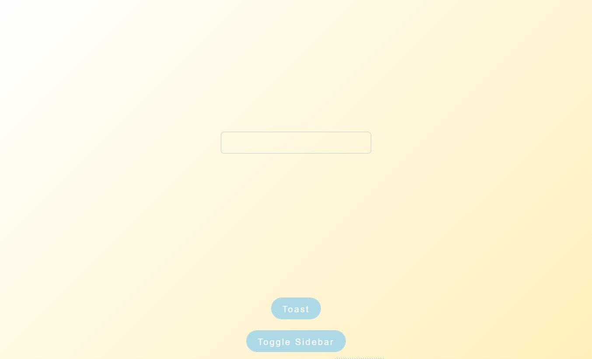
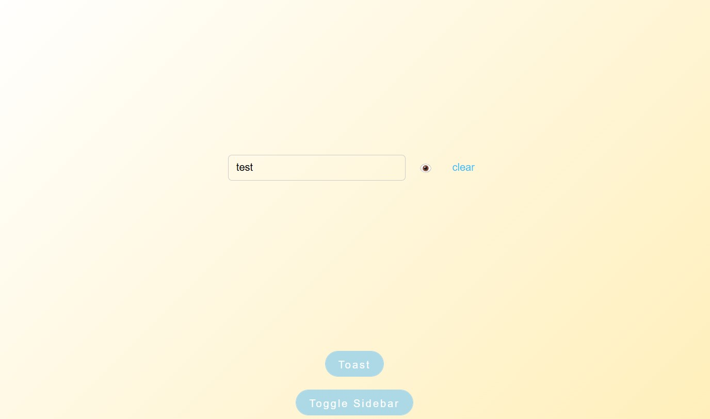
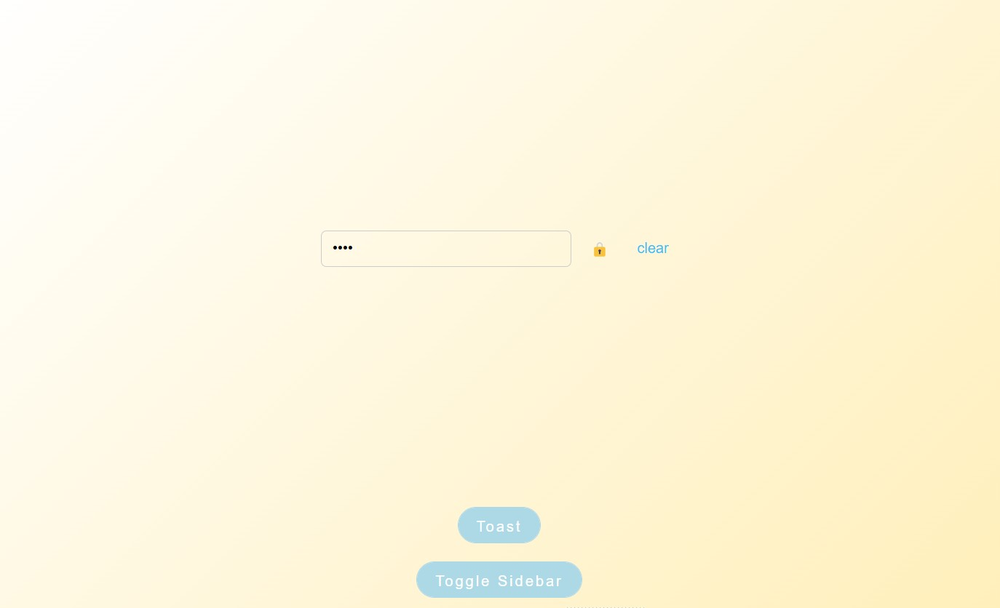
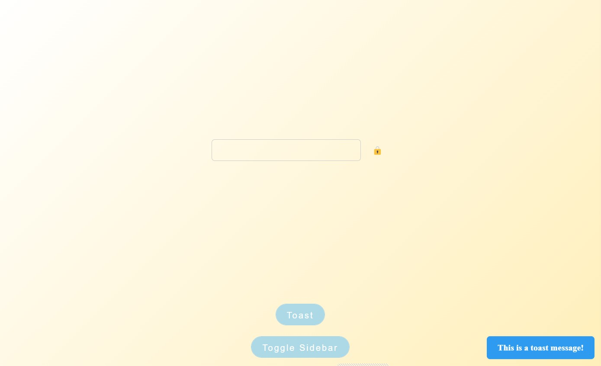
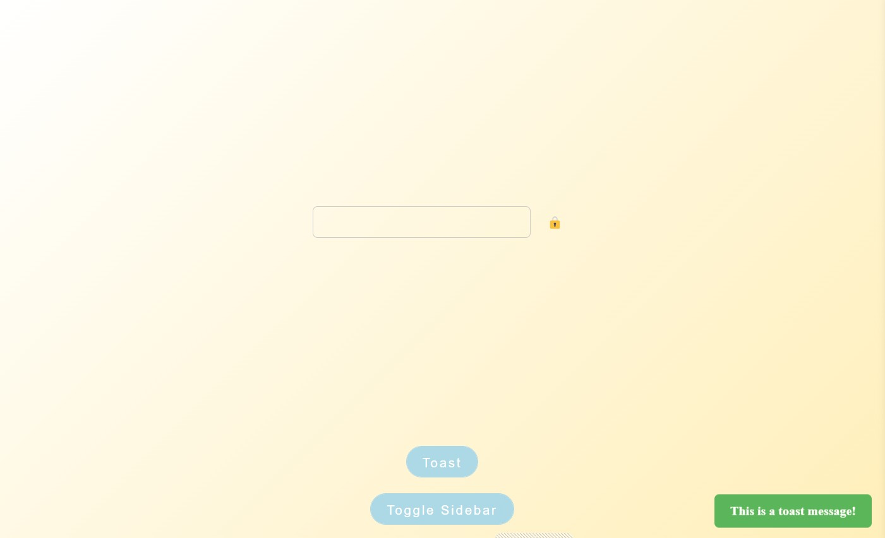
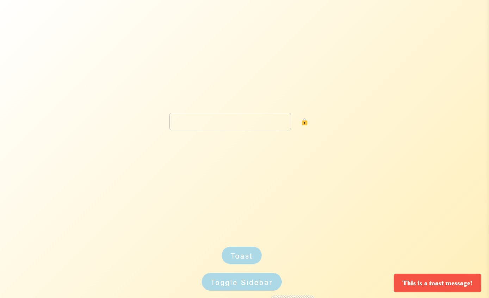
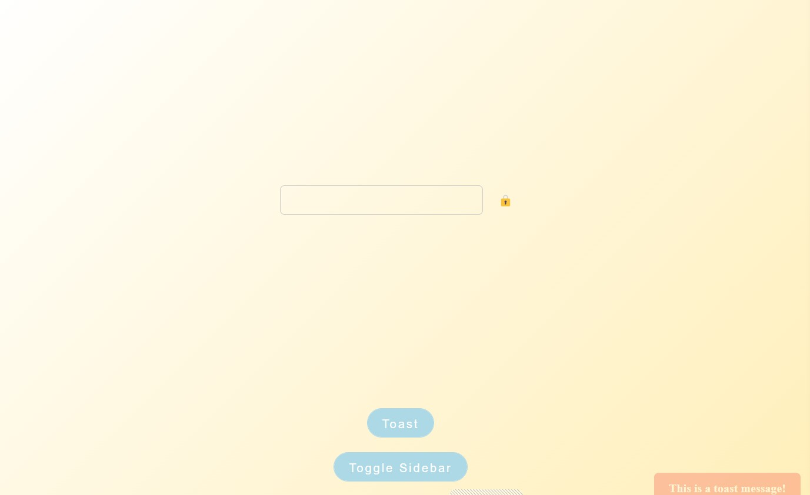
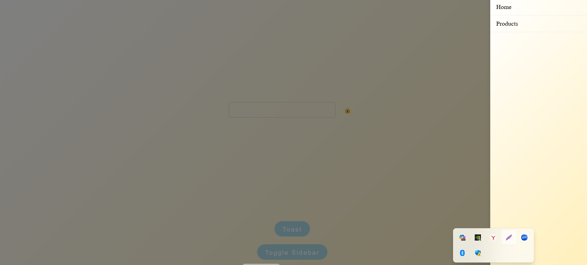
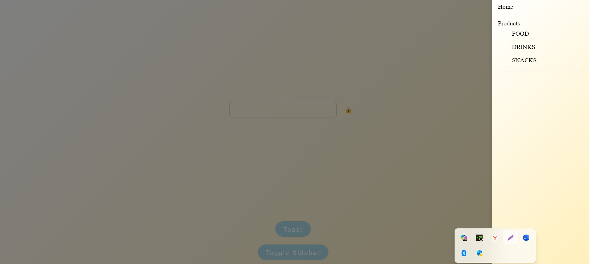

## Screenshots

### Input Component

| Default State  
| ----------------------------------------------- | |
| 
|  |
|  |

---

| Filled State

### Toast Component

| Enter State
| ------------------------------------------- |  
| 
| 
| 

---

| Exit State

                        |

### SidebarMenu Component

| Closed State
| ------------------------------------------------- |
| 

---

| Open State

### Storybook UI

